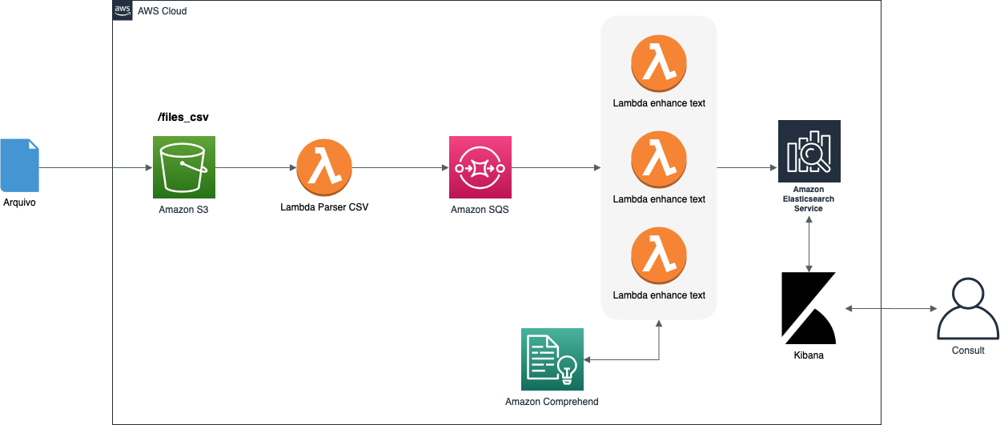

#  es-text-similarity-comprehend-demo

This is a demonstrantion has the purpose of how we can use Amazon Comprehend and Amazon Elasticsearch Service to create a search engine that could help us to search text similarity.

# Challenge

Brazilian Federal Senate staff waste a lot of time searching similarities between new propositions (Projeto de Lei, Projeto de Emendas Constitucionais e etc) and older propositions to avoid wasting time voting on something that was already voted in the past. The idea of this demonstration using open data to find similarities between propositions, using Amazon Comprehend or Amazon Elasticsearch

[Open Data Portal](https://dadosabertos.camara.leg.br/swagger/api.html#staticfile)

# Prerequisites

- Pre configured AWS credentials
- [Pre configured VPC](https://github.com/BRCentralSA/aws-brazil-edu-series/blob/master/utils/vpc-template.yaml)
    - The VPC should have at least 2 public subnets and 2 private subnets using NAT Gateway
- [awscli](https://docs.aws.amazon.com/cli/latest/userguide/cli-chap-install.html)


# Application architecture

<p align="center"> 

</p>

# Provisioning the infrastructure:

First you need to create a S3 bucket to store our application lambda code. (That will be used in CloudFormation Later)

Note: Replace <MY_BUCKET_NAME> to a bucket name that you are going to use. (Take note of the choosen bucket name)

```shell
aws s3 mb s3://<MY_BUCKET_NAME>
```

ZIPing (compressing) the lambda code.

```shell
cd lambda_enhance_text/ && zip ../lambda_enhance.zip lambda_function.py
```

```shell
cd ../lambda_parser_csv && zip ../lambda_csv_parser.zip lambda_function.py
```

```shell
cd ../
```

Uploading the lambda packages to the S3 bucket that we have created in the prior step.

```shell
aws s3 cp lambda_enhance.zip s3://<MY_BUCKET_NAME>/lambda/
```

```shell
aws s3 cp lambda_csv_parser.zip s3://<MY_BUCKET_NAME>/lambda/
```

Now we need to upload the Elasticsearch module that we will use to index the results of the data analysis.

```shell
cd layer && aws s3 cp elastic.zip s3://<MY_BUCKET_NAME>/layer/
```

**Now we need to create our stack using the CloudFormation template, available in cloudFormation/ folder in the root of this repository**